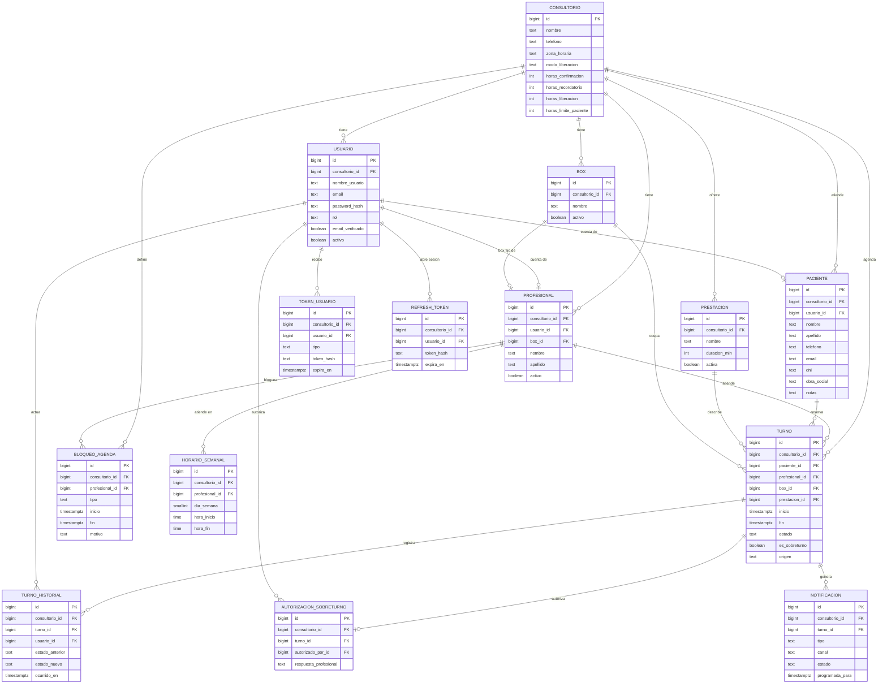

# Modelo de Datos

Modelo relacional para PostgreSQL, accedido mediante SQLAlchemy. Los nombres de tablas y columnas están en español (dominio) con términos técnicos en inglés.

## Principios

- **Preparado para varios consultorios.** Toda tabla que pertenece a un consultorio lleva `consultorio_id` (clave foránea a `consultorio`, no nula, con índice). En la v1 hay un único consultorio activo (RN-55 a RN-57). La única tabla sin `consultorio_id` es `consultorio`, que es el propio inquilino.
- **Aislamiento.** Toda consulta se filtra por el `consultorio_id` del token del usuario. Las claves únicas de negocio incluyen `consultorio_id`.
- **Fechas.** Instantes en `timestamptz` (UTC); la presentación usa `America/Argentina/Buenos_Aires` (SU-02, SU-36 en [09](09_decisiones_y_supuestos.md)). Horarios semanales en `time` sin zona, interpretados en la zona del consultorio.
- **Sin borrado físico** de turnos, pacientes ni usuarios: se cambia estado o se desactiva (`activo`).
- **Contraseñas** solo como hash (RN-04). Los tokens se guardan hasheados.
- **Auditoría.** `turno_historial` cubre los cambios de estado del turno. La auditoría general y el consentimiento de la Ley 25.326 están diferidos (backlog).

## Dominios

| Dominio | Entidades | Descripción |
|---------|-----------|-------------|
| Consultorio | `consultorio` | Inquilino y parámetros de operación. |
| Identidad y acceso | `usuario`, `token_usuario`, `refresh_token` | Cuentas, roles, verificación de correo, recuperación de contraseña y sesiones. |
| Agenda | `profesional`, `box`, `horario_semanal`, `bloqueo_agenda`, `prestacion` | Quién atiende, dónde, cuándo y qué. |
| Pacientes | `paciente` | Ficha mínima. |
| Turnos | `turno`, `autorizacion_sobreturno`, `turno_historial` | Reservas, sobreturnos y trazabilidad. |
| Comunicación | `notificacion` | Correos y mensajes de WhatsApp programados, enviados o preparados. |

## ERD (Entity Relationship Diagram)



El diagrama resume las columnas clave. El detalle completo está en las secciones siguientes. El tipo de clave primaria (`bigint` o UUID) es una decisión de implementación; el diagrama usa `bigint` solo como referencia.

## Entidades

### consultorio

Inquilino y parámetros de operación. En la v1 existe una única fila activa.

| Columna | Tipo | Notas |
|---------|------|-------|
| `id` | PK | |
| `nombre` | text, no nulo | |
| `telefono` | text | Se muestra al paciente cuando ya no puede autogestionar (RN-33). |
| `direccion` | text, nulo | |
| `zona_horaria` | text, no nulo | Valor inicial `America/Argentina/Buenos_Aires`. |
| `modo_liberacion` | enum `automatico` \| `manual` | Por defecto `automatico` (RN-27, RN-28). |
| `horas_confirmacion` | int, no nulo | Valor inicial 48 (RN-25). |
| `horas_recordatorio` | int, no nulo | Valor inicial 24 (RN-26). |
| `horas_liberacion` | int, no nulo | Valor inicial 12 (RN-27). |
| `horas_limite_paciente` | int, no nulo | Valor inicial 24 (RN-33). |
| `activo` | boolean | |

Los cuatro parámetros de horas se guardan por consultorio con los valores de las reglas como valor inicial (SU-25 en [09](09_decisiones_y_supuestos.md)).

### usuario

Cuenta de acceso de cualquier rol, incluido el paciente.

- Atributos: `id`, `consultorio_id`, `nombre_usuario` (text), `email` (text), `password_hash` (text), `rol` (enum `administrador` \| `recepcion` \| `profesional` \| `paciente` \| `administrativo`), `email_verificado` (boolean), `email_verificado_en` (timestamptz, nulo), `activo` (boolean), `intentos_fallidos` (int), `bloqueado_hasta` (timestamptz, nulo), `ultimo_ingreso_en` (timestamptz, nulo), `creado_en`, `actualizado_en`.
- Constraints: `UNIQUE (consultorio_id, nombre_usuario)`, `UNIQUE (consultorio_id, email)`. Un solo `rol` por usuario (RN-08).
- Reglas: el personal lo crea el Administrador (RN-07); el paciente se autorregistra (RN-01) y no puede ingresar hasta verificar el correo (RN-02).
- Índices: los de las claves únicas.

### token_usuario

Tokens de un solo uso: verificación de correo, recuperación de contraseña y confirmación de turno por enlace (RN-03, RN-30).

- Atributos: `id`, `consultorio_id`, `usuario_id`, `turno_id` (nulo; solo para `confirmar_turno`), `tipo` (enum `verificar_email` \| `recuperar_password` \| `confirmar_turno`), `token_hash`, `expira_en`, `usado_en` (nulo), `creado_en`.
- Constraints: `UNIQUE (token_hash)`. El token en claro solo viaja en el enlace del correo y nunca se guarda.
- Índices: `(usuario_id, tipo)`, `expira_en`.

### refresh_token

Sesiones renovables (SU-27 en [09](09_decisiones_y_supuestos.md)).

- Atributos: `id`, `consultorio_id`, `usuario_id`, `token_hash`, `expira_en`, `revocado_en` (nulo), `reemplazado_por_id` (nulo), `creado_en`.
- Constraints: `UNIQUE (token_hash)`. Rotación en cada renovación.
- Índices: `(usuario_id)`.

### box

Consultorio físico donde atiende un profesional.

- Atributos: `id`, `consultorio_id`, `nombre`, `activo`.
- Constraints: `UNIQUE (consultorio_id, nombre)`.

### profesional

- Atributos: `id`, `consultorio_id`, `usuario_id` (FK a `usuario`, rol `profesional`), `box_id` (FK a `box`), `nombre`, `apellido`, `activo`.
- Relaciones: 1 usuario : 0..1 profesional; 1 box : 0..1 profesional (cada profesional tiene un box fijo, RN-10); 1 profesional : N horarios, bloqueos y turnos.
- Constraints: `UNIQUE (usuario_id)`, `UNIQUE (box_id)`. La unicidad de `box_id` codifica la regla del box fijo. Compartir un box entre profesionales sería un cambio de modelo, no de configuración.
- Dato no relevado: matrícula y especialidad quedan fuera de la v1 porque las fuentes no las piden.

### horario_semanal

Bloques de atención recurrentes por día de la semana. Un profesional puede tener varios bloques por día (por ejemplo, mañana y tarde).

- Atributos: `id`, `consultorio_id`, `profesional_id`, `dia_semana` (1 = lunes a 7 = domingo), `hora_inicio` (time), `hora_fin` (time).
- Constraints: `CHECK (hora_inicio < hora_fin)`. No se permiten bloques superpuestos del mismo profesional y día (validación de aplicación, RN-11).
- Índices: `(profesional_id, dia_semana)`.

### bloqueo_agenda

Excepciones por fecha que bloquean la agenda (RN-12). Cubre feriados, vacaciones, ausencias del profesional y bloqueos puntuales.

- Atributos: `id`, `consultorio_id`, `profesional_id` (nulo = aplica a todos los profesionales, por ejemplo un feriado), `tipo` (enum `feriado` \| `vacaciones` \| `ausencia` \| `bloqueo`), `inicio` (timestamptz), `fin` (timestamptz), `motivo` (text, nulo), `creado_por_id`, `creado_en`.
- Constraints: `CHECK (inicio < fin)`.
- Índices: `(profesional_id, inicio, fin)`.
- Un día completo se representa con `inicio` a las 00:00 y `fin` a las 24:00 del día en la zona del consultorio.

### prestacion

Catálogo editable de servicios con duración (RN-13).

- Atributos: `id`, `consultorio_id`, `nombre`, `duracion_min` (int, mayor que 0), `descripcion` (nulo), `activa`, `creada_en`.
- Constraints: `UNIQUE (consultorio_id, nombre)`, `CHECK (duracion_min > 0)`.
- No hay precios en la v1 (la facturación está en el backlog).
- Todas las prestaciones activas están disponibles para todos los profesionales (SU-24).

### paciente

Ficha mínima (RN-47). Puede existir sin cuenta (alta por Recepción) o vinculada a un `usuario` con rol `paciente`.

- Atributos: `id`, `consultorio_id`, `usuario_id` (nulo, único), `nombre`, `apellido`, `telefono`, `email`, `dni`, `obra_social` (text, nulo; solo dato, RN-51), `notas` (text, nulo), `activo`, `creado_en`, `actualizado_en`.
- Constraints: `UNIQUE (consultorio_id, dni)` (RN-48), `UNIQUE (usuario_id)`.
- Índices: `(consultorio_id, apellido, nombre)`, `(consultorio_id, telefono)`.
- Vinculación con una ficha preexistente: no es automática (RN-49).
- Dato personal: aplica la Ley 25.326 desde la v1 (RN-58).

### turno

Reserva de un paciente con un profesional.

| Columna | Tipo | Notas |
|---------|------|-------|
| `id` | PK | |
| `consultorio_id` | FK, no nulo | |
| `paciente_id` | FK, no nulo | |
| `profesional_id` | FK, no nulo | |
| `box_id` | FK, no nulo | Se copia del box fijo del profesional al crear. |
| `prestacion_id` | FK, no nulo | |
| `inicio`, `fin` | timestamptz, no nulos | `fin = inicio + duracion de la prestación` (RN-13). `CHECK (inicio < fin)`. |
| `estado` | enum | `pendiente`, `confirmado`, `ausente`, `atendido`, `cancelado`, `liberado` (RN-18, RN-20). |
| `es_sobreturno` | boolean | Verdadero solo con autorización (RN-39). |
| `origen` | enum `online` \| `recepcion` | |
| `ciclo_confirmacion` | int, no nulo, inicial 1 | Se incrementa al reprogramar para reiniciar los hitos (RN-32). |
| `confirmacion_solicitada_en` | timestamptz, nulo | Hito de 48 h (RN-25). |
| `recordatorio_enviado_en` | timestamptz, nulo | Hito de 24 h (RN-26). |
| `confirmado_en` | timestamptz, nulo | |
| `marcado_sin_confirmar_en` | timestamptz, nulo | Marca "sin confirmar" del modo manual (RN-28). No es un estado. |
| `liberado_en` | timestamptz, nulo | |
| `cancelado_en`, `cancelado_por_id`, `motivo_cancelacion` | nulos | RN-36. |
| `reprogramado_de_inicio` | timestamptz, nulo | Inicio anterior, para la última reprogramación. El detalle completo queda en el historial. |
| `notas` | text, nulo | |
| `creado_por_id` | FK a `usuario` | Paciente o personal. |
| `creado_en`, `actualizado_en` | timestamptz | |

Constraints e índices:

- **No solapamiento por profesional** (RN-17): restricción de exclusión en PostgreSQL sobre el rango de tiempo.

```sql
-- Requiere la extensión btree_gist (SU-28 en 09).
ALTER TABLE turno ADD CONSTRAINT turno_sin_solapamiento
  EXCLUDE USING gist (
    consultorio_id WITH =,
    profesional_id WITH =,
    tstzrange(inicio, fin, '[)') WITH &&
  )
  WHERE (es_sobreturno = false
         AND estado IN ('pendiente', 'confirmado', 'atendido', 'ausente'));
```

- Los turnos `cancelado` y `liberado` no ocupan el hueco (RN-22). Los sobreturnos quedan fuera de la restricción por diseño (RN-39).
- Índices: `(consultorio_id, profesional_id, inicio)`, `(consultorio_id, paciente_id, inicio)`, `(estado, inicio)` para los trabajos programados.
- Lectura del box: como cada profesional tiene un box fijo, validar por profesional equivale a validar por box. `box_id` se conserva en el turno para consultas y para no perder el dato si el profesional cambia de box en el futuro.

### autorizacion_sobreturno

Registro de quién autorizó un sobreturno y cómo respondió el profesional afectado (RN-39 a RN-42).

- Atributos: `id`, `consultorio_id`, `turno_id` (único), `autorizado_por_id` (FK a `usuario`, rol `recepcion` o `administrador`), `autorizado_en`, `motivo` (text), `profesional_notificado_en` (timestamptz), `respuesta_profesional` (enum `sin_respuesta` \| `aprobado` \| `rechazado`), `respondido_en` (nulo), `comentario_profesional` (nulo).
- Constraints: `UNIQUE (turno_id)`.

### turno_historial

Bitácora inmutable de cambios de estado y reprogramaciones del turno (RN-21). Es la base del indicador de ausentismo.

- Atributos: `id`, `consultorio_id`, `turno_id`, `usuario_id` (nulo cuando actúa el sistema), `accion` (enum `crear`, `confirmar`, `cancelar`, `liberar`, `atendido`, `ausente`, `reprogramar`, `sobreturno`, `marcar_sin_confirmar`, `corregir`), `estado_anterior`, `estado_nuevo`, `detalle` (jsonb, nulo), `ocurrido_en`.
- Solo se inserta, nunca se modifica ni se borra.
- Índices: `(turno_id, ocurrido_en)`, `(consultorio_id, ocurrido_en)`.

### notificacion

Calendario de comunicaciones y registro de su resultado. Es la fuente de verdad que procesa el barrido idempotente de la API (SU-26).

- Atributos: `id`, `consultorio_id`, `turno_id` (nulo para correos de cuenta), `usuario_id` (nulo), `tipo` (enum `verificacion_email`, `recuperacion_password`, `solicitud_confirmacion`, `recordatorio`, `liberacion`, `cancelacion_por_personal`, `reprogramacion_por_personal`), `canal` (enum `email` \| `whatsapp`), `estado` (enum `programada`, `enviada`, `fallida`, `preparada`, `enviada_manual`, `omitida`), `destinatario` (text), `programada_para` (timestamptz), `enviada_en` (nulo), `intentos` (int), `ultimo_error` (text, nulo), `mensaje` (text, nulo; para WhatsApp), `enlace_whatsapp` (text, nulo), `marcada_enviada_por_id` (nulo).
- Estados del canal WhatsApp: `preparada` (el sistema armó el mensaje) y `enviada_manual` (Recepción lo envió y lo marcó) (RN-52).
- Índices: `(estado, programada_para)`, `(turno_id)`.
- Idempotencia: `ciclo` (int) copia el `ciclo_confirmacion` del turno al programar la notificación, y `UNIQUE (turno_id, tipo, canal, ciclo)` evita que un reintento o un disparo repetido del barrido duplique envíos. Al reprogramar, el turno incrementa su ciclo y las notificaciones pendientes del ciclo anterior pasan a `omitida` (RN-32).

## Datos semilla (seed data)

Se cargan al inicializar un entorno vacío. No incluyen datos reales de pacientes.

### Consultorio inicial

| Campo | Valor |
|-------|-------|
| `nombre` | A definir por el consultorio (valor de configuración, ver [10](10_preguntas_abiertas.md)) |
| `zona_horaria` | `America/Argentina/Buenos_Aires` |
| `modo_liberacion` | `automatico` |
| `horas_confirmacion` / `horas_recordatorio` / `horas_liberacion` / `horas_limite_paciente` | 48 / 24 / 12 / 24 |

### Usuario administrador inicial

Se crea una vez a partir de variables de entorno (`BOOTSTRAP_ADMIN_EMAIL`, `BOOTSTRAP_ADMIN_PASSWORD`, ver [08](08_arquitectura_propuesta.md)). Rol `administrador`, correo marcado como verificado. La contraseña nunca se versiona en el repositorio.

### Catálogo inicial de prestaciones

Catálogo editable de prestaciones comunes. **Las duraciones son sugerencias** propuestas al armar esta base de conocimiento; el consultorio debe confirmarlas o corregirlas antes de la puesta en marcha (SU-23 en [09](09_decisiones_y_supuestos.md)). No se cargan precios.

| Prestación | Duración sugerida (min) | Estado de la duración |
|------------|-------------------------|-----------------------|
| Primera consulta y diagnóstico | 30 | Sugerida, a confirmar |
| Control de rutina | 20 | Sugerida, a confirmar |
| Limpieza dental (profilaxis) | 40 | Sugerida, a confirmar |
| Restauración (arreglo de caries) | 45 | Sugerida, a confirmar |
| Endodoncia (tratamiento de conducto) | 60 | Sugerida, a confirmar |
| Extracción simple | 30 | Sugerida, a confirmar |
| Blanqueamiento | 60 | Sugerida, a confirmar |
| Control de ortodoncia | 20 | Sugerida, a confirmar |
| Urgencia o consulta por dolor | 30 | Sugerida, a confirmar |

### Lo que no se siembra

- Feriados: se cargan manualmente como `bloqueo_agenda` de tipo `feriado` (SU-30).
- Profesionales, boxes, horarios y pacientes: los crea el Administrador o Recepción al configurar el consultorio.
- Roles: son un valor enumerado de `usuario.rol`, no una tabla.

## Mapa de cumplimiento de reglas

| Regla | Dónde se garantiza |
|-------|--------------------|
| RN-10 box fijo por profesional | `UNIQUE (box_id)` en `profesional` |
| RN-17 sin solapamientos | Restricción de exclusión en `turno` |
| RN-24 concurrencia de reservas | La misma restricción de exclusión; la aplicación traduce el error en un mensaje de horario ocupado |
| RN-48 DNI único | `UNIQUE (consultorio_id, dni)` |
| RN-55 aislamiento por consultorio | `consultorio_id` en todas las tablas y en todo filtro |
