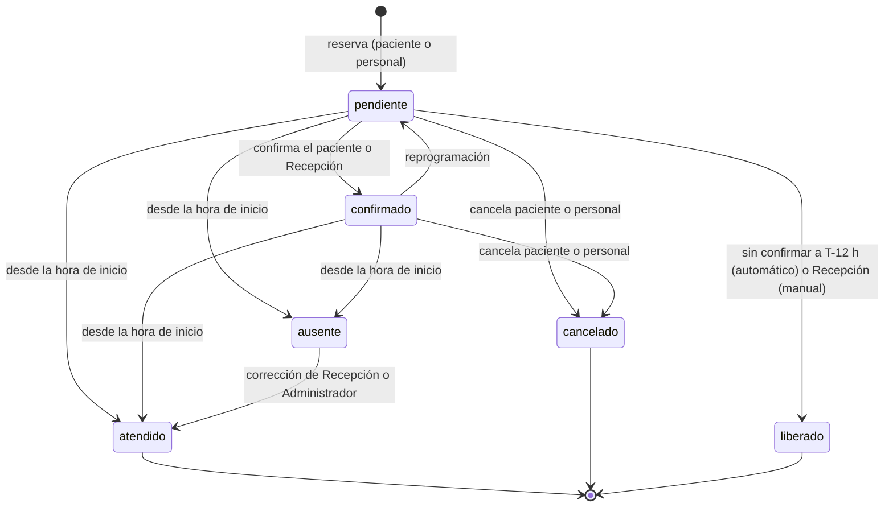
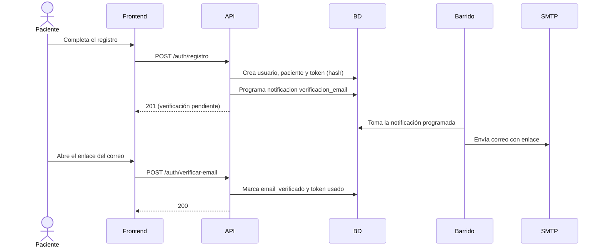
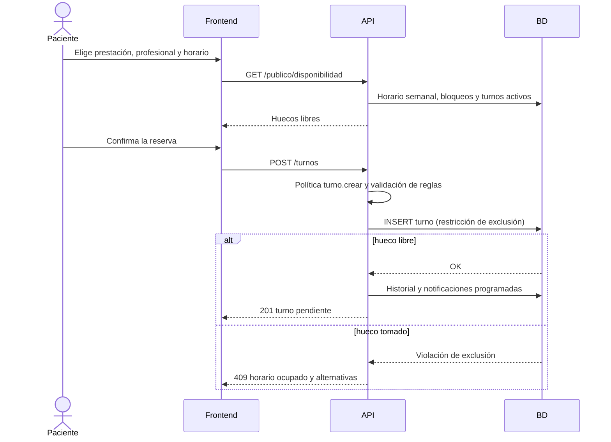
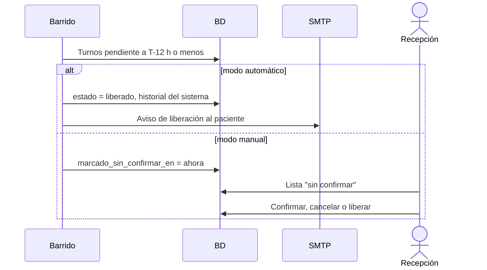
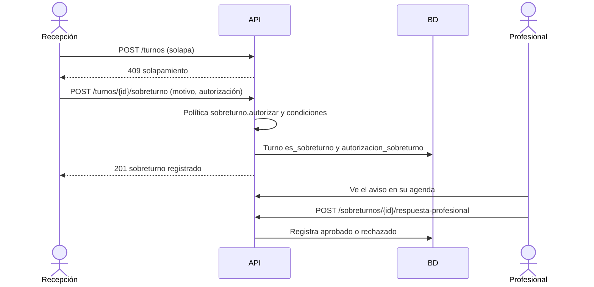

# Flujos Principales

Cada flujo se documenta extremo a extremo con los componentes que intervienen: **Frontend** (SPA), **API** (FastAPI), **BD** (PostgreSQL), **Barrido** (trabajo programado dentro de la API, activado por un disparador HTTP externo, con candado en PostgreSQL), **SMTP** (servidor de correo) y los actores humanos. Las reglas citadas están en [05](05_reglas_de_negocio.md) y las políticas en [11](11_politicas_de_acceso_abac.md).

## Índice de flujos

| # | Flujo | Casos de uso | Reglas clave |
|---|-------|--------------|--------------|
| 1 | Registro de paciente y verificación de correo | CU-1 | RN-01 a RN-04, RN-47 a RN-49 |
| 2 | Ingreso y recuperación de contraseña | CU-1 | RN-05, RN-06, RN-09 |
| 3 | Reserva online | CU-1 | RN-13, RN-14, RN-17, RN-23, RN-24, RN-29 |
| 4 | Confirmación y recordatorio | CU-1, CU-2 | RN-25, RN-26, RN-30 |
| 5 | Liberación automática y modo manual | CU-2 | RN-27, RN-28, RN-22 |
| 6 | Cancelación y reprogramación | CU-1 | RN-32, RN-33, RN-34, RN-37 |
| 7 | Autorización de sobreturno | CU-3 | RN-39 a RN-43 |
| 8 | Marcado de atendido y ausente | CU-4 | RN-38, RN-44 |
| 9 | WhatsApp con un clic | CU-2 | RN-52 a RN-54 |
| 10 | Indicador de ausentismo | CU-5 | RN-44 a RN-46 |

## Ciclo de vida del turno

La marca "sin confirmar" del modo manual no es un estado: es `marcado_sin_confirmar_en` sobre un turno `pendiente` (RN-28).

## Flujo 1: Registro de paciente y verificación de correo

**Disparador**: una persona abre el enlace público de reserva y elige registrarse.
**Actor**: Paciente.

**Pasos**:
1. Frontend muestra el formulario: nombre y apellido, teléfono, correo, DNI, obra social (opcional), usuario y contraseña.
2. Frontend envía `POST /auth/registro`. API valida formato y unicidad (usuario, correo, DNI) dentro del consultorio.
3. API crea `usuario` (rol `paciente`, `email_verificado = false`, contraseña hasheada) y la ficha de `paciente`. Si el DNI ya existe sin cuenta, no se vincula (RN-49) y se avisa al paciente que Recepción verificará la identidad.
4. API genera un token de verificación de un solo uso, guarda su hash en `token_usuario` y programa el correo en `notificacion` (`verificacion_email`).
5. La API intenta enviar de inmediato el correo por SMTP (mismo caso de uso que el barrido; si falla, el siguiente barrido lo reintenta) con el enlace `FRONTEND_BASE_URL/verificar-email?token=...`.
6. El paciente abre el enlace. Frontend envía `POST /auth/verificar-email`.
7. API valida el token (existe, no usado, no vencido), marca `email_verificado` y `usado_en`.
8. Frontend redirige a `/login`.

**Casos de error**:
- Usuario, correo o DNI ya existentes → error de campo, sin revelar datos de otra persona más allá de lo necesario.
- Token vencido o ya usado → mensaje claro y opción de reenviar (`POST /auth/reenviar-verificacion`).
- Falla del SMTP → la notificación queda `fallida` y se reintenta de forma acotada (RN-31); el paciente puede pedir el reenvío.
- Intento de ingreso sin verificar → rechazo con opción de reenviar (RN-02).

## Flujo 2: Ingreso y recuperación de contraseña

**Disparador**: un usuario ingresa o pierde su contraseña.
**Actor**: cualquier rol.

**Pasos de ingreso**:
1. Frontend envía `POST /auth/login` con usuario y contraseña.
2. API aplica la limitación de intentos (RN-09), verifica el hash y, para pacientes, que el correo esté verificado.
3. API devuelve el JWT de acceso (usuario, `consultorio_id`, rol) y una sesión renovable (RN-06).
4. Frontend resuelve las pantallas según el rol.

**Pasos de recuperación**:
1. El usuario pide recuperar la contraseña. `POST /auth/recuperar-password` responde igual exista o no el correo (RN-05).
2. Si la cuenta existe, API crea un token de un solo uso y la API intenta enviar el enlace de inmediato (si falla, el siguiente barrido lo reintenta).
3. El usuario abre el enlace y envía la nueva contraseña a `POST /auth/restablecer-password`.
4. API valida el token, guarda el nuevo hash, marca el token como usado y revoca las sesiones activas.

**Casos de error**:
- Credenciales inválidas → mensaje genérico, se cuenta el intento.
- Cuenta bloqueada temporalmente → mensaje con aviso de reintento posterior.
- Token de recuperación vencido o usado → se ofrece pedir uno nuevo.

## Flujo 3: Reserva online

**Disparador**: el paciente quiere un turno.
**Actor**: Paciente (con cuenta verificada).

**Pasos**:
1. Frontend consulta `GET /publico/prestaciones` y `GET /publico/profesionales`.
2. El paciente elige prestación y profesional. Frontend consulta `GET /publico/disponibilidad`.
3. API calcula los huecos: horario semanal del profesional, menos excepciones, menos turnos activos, con la duración de la prestación (RN-11 a RN-14, RN-17).
4. El paciente elige un horario. Si no tiene sesión, ingresa o se registra (flujos 1 y 2) y vuelve a la elección.
5. Frontend envía `POST /turnos`. API aplica la política (`turno.crear`: paciente solo para sí, correo verificado).
6. API inserta el turno `pendiente` con `fin = inicio + duración` y el box del profesional. La restricción de exclusión de la BD resuelve la concurrencia (RN-24).
7. API registra en `turno_historial`, programa en `notificacion` los hitos de confirmación (T-48 h), recordatorio (T-24 h) y evalúa la liberación (T-12 h). Los hitos ya vencidos se omiten (RN-29).
8. API envía el correo con el resumen del turno.

**Casos de error**:
- Horario tomado entre la consulta y la reserva → 409 con alternativas (RN-24).
- Fuera de horario o sobre un bloqueo → 422 (RN-14).
- Correo sin verificar → se ofrece el reenvío (RN-02).
- Reserva dentro de una ventana de hitos ya vencidos → el turno se crea y los hitos vencidos se omiten (RN-29).

## Flujo 4: Confirmación y recordatorio

**Disparador**: el barrido detecta una notificación con `programada_para` vencida (T-48 h o T-24 h).
**Actor**: Sistema, Paciente y Recepción.

**Pasos de la solicitud de confirmación (T-48 h)**:
1. El barrido toma las notificaciones `programada` vencidas (con candado en PostgreSQL para evitar duplicados) y verifica que el turno siga `pendiente` y en el mismo ciclo (RN-32).
2. El barrido envía el correo con el enlace de confirmación (token de un solo uso, RN-30) y marca `confirmacion_solicitada_en`.
3. El barrido crea la notificación de canal WhatsApp en estado `preparada` con el texto y el enlace `wa.me` (flujo 9).
4. El paciente confirma desde su cuenta o desde el enlace del correo: la API pasa el turno a `confirmado`, registra `confirmado_en` y el historial.

**Pasos del recordatorio (T-24 h)**:
1. El barrido envía el recordatorio a los turnos `pendiente` y `confirmado` (RN-26). En los `pendiente` el texto advierte la liberación a las 12 horas.
2. Se prepara el mensaje de WhatsApp correspondiente.

**Pasos de confirmación por el personal**:
1. Recepción confirma por teléfono o WhatsApp y marca el turno `confirmado` (`POST /turnos/{id}/confirmar`).

**Casos de error**:
- Falla de SMTP → reintento acotado y luego `fallida`, visible para Recepción (RN-31, US-035).
- El turno ya fue cancelado, liberado o reprogramado → la notificación se marca `omitida`.
- El paciente abre el enlace después de la liberación → mensaje de turno liberado y opción de reservar de nuevo.
- El enlace de confirmación vencido o usado → debe ingresar con su cuenta.

## Flujo 5: Liberación automática y modo manual

**Disparador**: el barrido detecta un turno `pendiente` a 12 horas o menos de su inicio.
**Actor**: Sistema y Recepción.

**Pasos en modo automático** (`modo_liberacion = automatico`):
1. El barrido selecciona los turnos `pendiente` con `inicio - horas_liberacion <= ahora` en su ciclo actual.
2. Por cada turno, API ejecuta la transición a `liberado` en una sola transacción, con `liberado_en`, historial (actor: sistema) y hueco disponible (RN-22).
3. El barrido envía el aviso de liberación por correo al paciente (RN-27) y prepara el de WhatsApp.

**Pasos en modo manual** (`modo_liberacion = manual`):
1. El barrido marca el turno con `marcado_sin_confirmar_en` y lo deja `pendiente` (RN-28).
2. Recepción ve la lista "sin confirmar" y, por cada turno, decide: llamar y confirmar, cancelar o liberar (`POST /turnos/{id}/liberar`).

**Casos de error**:
- El paciente confirma justo antes de la liberación → la transición es idempotente y condicional: solo libera si el estado sigue `pendiente`.
- El turno se creó con menos de 12 horas de anticipación → no se libera de forma automática; queda con la marca "sin confirmar" (RN-29).
- Falla del disparador externo o servicio dormido → al volver, el siguiente barrido procesa los vencidos sin duplicar (SU-26).

## Flujo 6: Cancelación y reprogramación

**Disparador**: el paciente o el personal cambian un turno.
**Actor**: Paciente, Recepción o Administrador.

**Pasos de cancelación por el paciente**:
1. Frontend muestra "Cancelar" solo si faltan 24 horas o más (RN-33). API lo verifica de nuevo (política A4).
2. API cambia el estado a `cancelado`, registra quién, cuándo y el motivo opcional (RN-36), libera el hueco y omite las notificaciones pendientes.
3. Se envía confirmación de la cancelación por correo.

**Pasos de reprogramación por el paciente**:
1. El paciente elige un nuevo horario entre los disponibles.
2. API valida las reglas (RN-14, RN-17) y reserva el nuevo horario antes de liberar el anterior, en una sola transacción (RN-37).
3. El turno vuelve a `pendiente`, se incrementa `ciclo_confirmacion` y se reprograman los hitos (RN-32). Queda en el historial.

**Pasos por el personal**: igual, pero sin límite de 24 horas y mientras el turno no esté `atendido` (RN-34). Se avisa al paciente por correo y se prepara el mensaje de WhatsApp (US-034).

**Casos de error**:
- A menos de 24 horas, el paciente ve el mensaje con el teléfono del consultorio (RN-33).
- Nuevo horario ocupado → el turno original se mantiene (RN-37).
- Turno `atendido` → rechazado para todos los roles (RN-19).
- Un paciente intenta operar el turno de otro → 404 (RN-35).

## Flujo 7: Autorización de sobreturno

**Disparador**: Recepción necesita agendar sobre un horario ya ocupado de un profesional.
**Actor**: Recepción (o Administrador) y Profesional afectado.

**Pasos**:
1. Recepción intenta crear el turno. API detecta el solapamiento y rechaza el alta normal (RN-17).
2. Recepción elige "Autorizar sobreturno", indica el motivo y confirma que avisó al profesional (RN-39, RN-40).
3. API verifica la política `sobreturno.autorizar` y las condiciones (horario semanal y sin bloqueos, RN-43).
4. API crea el turno con `es_sobreturno = true` (queda fuera de la restricción de exclusión) y la fila de `autorizacion_sobreturno` con autorizante, fecha y aviso (RN-41).
5. El profesional recibe el aviso en su agenda y, si lo desea, aprueba o rechaza (`respuesta_profesional`). La respuesta queda registrada.
6. El turno se marca como sobreturno en todas las vistas (RN-42).

**Casos de error**:
- Paciente o Profesional intentan generar un sobreturno → 403 (RN-39).
- Fuera del horario del profesional o sobre un bloqueo → 422 (RN-43).
- Si el profesional rechaza, el sistema lo registra y lo muestra a Recepción; si el otorgamiento queda sin efecto es una pregunta abierta ([10](10_preguntas_abiertas.md)).

## Flujo 8: Marcado de atendido y ausente

**Disparador**: llega la hora del turno.
**Actor**: Profesional (propio), Recepción o Administrador.

**Pasos**:
1. El Profesional ve su agenda del día con el estado de cada turno (CU-4).
2. Si el paciente es atendido, marca `atendido`; si no se presenta, marca `ausente`. API verifica A1 (agenda propia), A3 (estado permitido) y A4 (hora de inicio alcanzada).
3. API cambia el estado y registra el historial con el actor.
4. Un turno `atendido` queda inmutable (RN-19). Si un `ausente` fue marcado por error, Recepción o Administrador lo corrigen a `atendido` y queda registrado.

**Casos de error**:
- Antes de la hora de inicio → rechazo (RN-44).
- Turno de otro profesional → 404 o 403 según la política (A1).
- Turno `cancelado` o `liberado` → no admite el cambio.

## Flujo 9: WhatsApp con un clic

**Disparador**: el barrido genera una notificación de canal WhatsApp (confirmación, recordatorio, liberación o cambio por el personal).
**Actor**: Recepción.

**Pasos**:
1. El barrido crea la `notificacion` con canal `whatsapp`, estado `preparada`, el texto del mensaje (RN-54) y el enlace `https://wa.me/<telefono>?text=<mensaje codificado>` con el teléfono normalizado (RN-53).
2. Recepción abre la lista "WhatsApp pendientes", ordenada por urgencia (hito más próximo primero).
3. Con un clic, el navegador abre WhatsApp (web o aplicación) con el chat y el texto prellenados.
4. Recepción envía el mensaje desde su WhatsApp y marca la notificación como enviada (`POST /notificaciones/{id}/marcar-enviada`). El estado pasa a `enviada_manual` y queda registrado quién.

**Casos de error**:
- Teléfono sin formato válido → se avisa a Recepción para corregir la ficha.
- Recepción no envía el mensaje → la notificación sigue `preparada` y visible; el sistema no puede verificar la entrega (riesgo registrado en [09](09_decisiones_y_supuestos.md)).
- El turno cambió de estado antes del envío → la notificación se marca `omitida` y se retira de la lista.

## Flujo 10: Indicador de ausentismo

**Disparador**: el Administrador abre el indicador.
**Actor**: Administrador.

**Pasos**:
1. Frontend envía `GET /indicadores/ausentismo` con período y, opcionalmente, profesional.
2. API verifica la política `indicador.ausentismo` (solo Administrador).
3. API calcula sobre los turnos del período: cantidad de `ausente`, tasa `ausentes / (atendidos + ausentes)` (RN-45) y, por separado, cantidad de `liberado` y `cancelado`.
4. Frontend muestra totales, evolución por período y detalle por profesional.

**Casos de error**:
- Rol sin permiso → 403 (RN-46).
- Período sin turnos cuya hora haya llegado → se muestra sin tasa, sin dividir por cero.
- Turnos pasados sin marcar (siguen `pendiente` o `confirmado` después de su hora) → se informan como "sin cierre" para que el personal los marque; no se cuentan como ausentes.
